<p align="center">
  
</p>

# lint

[](https://github.com/trycopilotai/lint/actions/workflows/ci.yml)
[](https://github.com/trycopilotai/lint/actions/workflows/images.yml)
[](https://github.com/trycopilotai/lint/actions/workflows/release.yml)

`lint` is one read-only-by-default formatting interface for
local tools and independently addressable per-language
Docker images. It uses an explicit working directory and
applies writes only after every selected formatter succeeds.

`lint` is read-only by default.

Each language has an independently addressable Docker image.

<picture>
  <source
    media="(prefers-reduced-motion: reduce)"
    srcset="assets/poster.svg"
  />
  
</picture>

The terminal session is reconstructed from
[`evidence/demo-transcript.txt`](evidence/demo-transcript.txt);
its generation record is
[`evidence/demo-manifest.json`](evidence/demo-manifest.json).
The reduced-motion source is the static
[`assets/poster.svg`](assets/poster.svg). The upload-ready
1280×640 social preview is
[`assets/social-preview.png`](assets/social-preview.png).

## Comparison

Every cell describing another project is a verbatim quote
the project wrote about itself, read on 2026-08-02, taken
from its documentation site, its repository, or its own
marketplace listing. Each quote is retained with the text
surrounding it on the page, so you can see it was not lifted
out of a paragraph that contradicts it; the quotes, their
pages, and those captures are in
[`evidence/comparison-sources.json`](evidence/comparison-sources.json),
and `python3 tools/capture_comparison_sources.py` re-fetches
them all. No page hash is recorded: several of these pages
change on every request, so a digest would report drift that
had not happened. The `lint` row describes this project and
is not a quotation.

| Project                                                                            | Advertised breadth                                                                                                    | How the project describes its role                                                                                                                                  | How tools or images are delivered                                                                                                    |
| ---------------------------------------------------------------------------------- | --------------------------------------------------------------------------------------------------------------------- | ------------------------------------------------------------------------------------------------------------------------------------------------------------------- | ------------------------------------------------------------------------------------------------------------------------------------ |
| `lint`                                                                             | 28 language entries in [`images/matrix.json`](images/matrix.json)                                                     | All supported files below the working directory, read-only                                                                                                          | One independently addressable image per language                                                                                     |
| [MegaLinter](https://megalinter.io/latest/)                                        | [Supports 69 languages, 23 formats, 22 tooling formats](https://megalinter.io/latest/)                                | [At each pull request, it automatically analyzes all updated code across all languages.](https://megalinter.io/latest/)                                             | [we provide flavored MegaLinter images containing only the linters related to a project type](https://megalinter.io/latest/flavors/) |
| [Trunk Code Quality](https://marketplace.visualstudio.com/items?itemName=trunk.io) | [Trunk Code Quality runs 100+ tools](https://marketplace.visualstudio.com/items?itemName=trunk.io)                    | [Trunk consists of a C++ CLI that orchestrates the download, installation, and execution of third-party static analysis tools.](https://docs.trunk.io/code-quality) | [Trunk manages tools and their runtimes hermetically.](https://docs.trunk.io/code-quality)                                           |
| [pre-commit](https://github.com/pre-commit/pre-commit)                             | [A framework for managing and maintaining multi-language pre-commit hooks.](https://github.com/pre-commit/pre-commit) | [We run our hooks on every commit to automatically point out issues in code](https://pre-commit.com/)                                                               | [pre-commit manages the installation and execution of any hook written in any language](https://pre-commit.com/)                     |

Launch success is measured by merged external contributions
that add a formatter, an exact formatter golden, or
release-provenance coverage while keeping `make verify`
passing. Repository stars are not the success metric.

## Quick start

Check every supported file under the current directory:

```sh
python3 lint.py
make lint
```

Apply all formatting only after every formatter succeeds:

```sh
python3 lint.py --write
make lint ARGS=--write
```

Check only modified Git-tracked files:

```sh
python3 lint.py --modified
make lint ARGS=--modified
```

Run from another directory or select a language:

```sh
python3 lint.py --cwd ../project
make lint_ts
make lint_python
make lint_scss
```

Use the language-specific Docker images:

```sh
python3 dlint.py
make dlint_markdown
make dlint_less
```

Once the matching `v0.1.5` tag is published, use the
composite GitHub Action:

```yaml
steps:
  - uses: actions/checkout@fbc6f3992d24b796d5a048ff273f7fcc4a7b6c09
  - uses: trycopilotai/lint@v0.1.5
    with:
      mode: read-only
      cwd: .
      docker: "true"
```

The Action uses Docker by default, so the example does not
depend on formatter versions installed on the runner. Set
`docker: "false"` only after provisioning every pinned local
formatter.

`--read-only`, `--readonly`, and `-ro` are equivalent.
`--write`, `--apply`, and `-w` are equivalent. `--docker`
and `-d` select the Docker backend. Output is human-readable
by default; `--json` emits the stable result object.

To bind every Docker invocation to the exact digests from a
verified release manifest:

```sh
python3 lint.py --docker \
  --image-manifest release-manifest-0.1.5.json
make lint ARGS="--docker --image-manifest release-manifest-0.1.5.json"
```

The manifest must exactly match this release's source
metadata, formatter versions, and complete 28-image set.
Missing, extra, malformed, or mismatched fields fail before
Docker runs. This structural validation does not
authenticate the manifest itself; verify its release
checksum or signature before passing it to the CLI.
`--image-manifest` is rejected with the local backend.

## Selection

With no paths or selection flag, `lint.py` behaves as
`--all`. In a Git worktree, that means tracked files plus
nonignored untracked files below `--cwd`. Outside Git, lint
uses a pruned directory walk. `--modified` includes staged
and unstaged modified tracked files and excludes untracked
files.

Explicit paths and NUL-delimited `--files-from0` input are
also supported. Paths must stay below `--cwd`, and parent
traversal is rejected. Discovered symbolic links and paths
behind linked directories are excluded from `--all` and
directory expansion without being followed. A symbolic link
named explicitly or through `--files-from0` is rejected as a
selection error.

## Formatters

The default policy covers:

- Markdown, HTML, YAML, JSON, JavaScript, TypeScript, TSX,
  CSS, SCSS, and Less with Prettier
- Bazel files with Buildifier
- Python with Black
- requirements files with deterministic sorting that keeps
  backslash continuation blocks intact
- shell files with shfmt
- C, C++, Objective-C, and Objective-C++ with clang-format
- Java with google-java-format
- Go with gofmt
- Rust with rustfmt
- Kotlin with ktlint
- TOML with Taplo
- XML and plist files with xmllint
- Swift with swift-format
- C# with CSharpier
- Julia with JuliaFormatter

Pinned versions are recorded in `languages.json`. Local runs
report an install hint when a required executable is absent.
Docker runs pull
`ghcr.io/trycopilotai/lint-<language>:0.1.5`, which resolves
only once the matching image package is published. The
release workflow checks each built image against its
compressed-size budget. For Linux AMD64 it also compares
every final filesystem path, type, mode, link target,
regular-file SHA-256, and reviewed role against the
checked-in canonical inventory for that target. An extra,
missing, or changed entry fails verification. A matching
v0.1.5 tag builds and publishes the image set for Linux
AMD64 and Linux ARM64. The release manifest records each
promoted image digest alongside the source archive and its
checksums.

Prettier always uses `printWidth: 60`, `proseWrap: always`,
and `trailingComma: none`; Black always uses line length 88.
Native data configuration below `--cwd` is copied into the
same isolated mirror as the selected file, so nonlocked
options apply identically to local and Docker runs. This
includes Prettier, EditorConfig, Black, shfmt, clang-format,
rustfmt, ktlint, Taplo, swift-format, CSharpier, and
JuliaFormatter configuration. Formatter ignore files are not
copied and cannot suppress an engine-selected file.
Executable Prettier configuration and project Prettier
plugins are outside this release and fail explicitly. Black
selection options that could exclude a selected path also
fail explicitly.

## HTTP API

Run the loopback-only service:

```sh
python3 service.py
```

It exposes:

- `GET /healthz`
- `GET /v1/languages`
- `POST /v1/lint`

`POST /v1/lint` accepts the public `policy_id: "default"`,
the canonical modes `check` and `fix`, and file objects with
`path` and `input_bytes_base64`. The `read-only` and `write`
aliases normalize to those canonical modes; `readonly` and
`apply` are accepted too. For example:

```sh
curl --fail-with-body \
  --header 'Content-Type: application/json' \
  --data '{"policy_id":"default","mode":"check","files":[{"path":"requirements.txt","input_bytes_base64":"emV0YT09MQphbHBoYT09MQo="}]}' \
  http://127.0.0.1:8080/v1/lint
```

Limits are 64 files, 2 MiB per file, 16 MiB per request, and
30 seconds per formatter. The service returns formatted
bytes without modifying caller files. It binds to loopback
by default. Authentication is outside the bundled
development service and must be supplied by any deployment
that exposes it beyond the local machine.

## Development

```sh
make test
make verify
```

`make verify` runs every Python test file, the repository
structure and launch-surface verifier, and the complete Git
history disclosure scan. `make codec` checks Markdown, YAML,
and JSON formatting; `make pyformat` checks Python
formatting. The local command does not build multi-platform
images or reproduce GitHub-hosted operating-system matrices,
registry compressed-layer measurements, vulnerability scans,
or artifact attestations. The Images and Release workflows
own those surfaces; `python3 images/verify_images.py` checks
the manifest, pins, Dockerfile policy, and local images
supplied with `--local-prefix`.

The checked-in canonical inventory set covers the 15 AMD64
images. No ARM64 canonical inventory exists, so no job
compares ARM64 image contents against one. The Images and
Release workflows still build every ARM64 image and check
its formatter identity, smoke behavior, golden output
parity, compressed-layer budget, and known vulnerabilities.

A release tag must carry the same version as
[`images/matrix.json`](images/matrix.json). Such a tag
builds Linux AMD64 and Linux ARM64 images. It attaches a
software bill of materials to each published image in the
registry and stages a draft GitHub release carrying the
source archive, its manifest, and `SHA256SUMS`. A tag whose
version does not match stops with an error rather than
publishing a release with no images behind it. Software
bills of materials are registry attachments on the images,
not release assets. Every draft includes a deterministic
in-toto provenance statement bound to the source, workflow,
archive, release manifest, and image digests. The repository
is public, so the workflow also attaches GitHub-hosted
signed artifact attestations.

See [CONTRIBUTING.md](CONTRIBUTING.md) for changes and
[SECURITY.md](SECURITY.md) for vulnerability reports.

Issues use the `formatter` and `supply-chain` domain labels.
Starter tasks use `good first issue`.

## Claude Code

Once the matching `v0.1.5` release is published, install the
pinned standalone skill without authentication:

```sh
archive="$(mktemp -d)"
target="${CLAUDE_CONFIG_DIR:-$HOME/.claude}/skills/lint"
install -d "$target"
release=v0.1.5
version="${release#v}"
base="https://github.com/trycopilotai/lint/releases/download/$release"
curl --fail --location "$base/lint-$version.tar.gz" \
  >"$archive/lint-$version.tar.gz"
curl --fail --location "$base/SHA256SUMS" \
  >"$archive/SHA256SUMS"
( cd "$archive" && shasum -a 256 -c --ignore-missing SHA256SUMS )
tar -xzf "$archive/lint-$version.tar.gz" \
  --strip-components=1 \
  -C "$target"
cp "$target/skills/lint/SKILL.md" "$target/SKILL.md"
cp "$target/skills/lint/run.py" "$target/run.py"
```

The standalone invocation is `/lint`. A Claude marketplace
distribution uses `/lint:lint`.

## Codex

Once the matching `v0.1.5` release is published, install the
same pinned skill into the Codex skill store without
authentication:

```sh
archive="$(mktemp -d)"
target="${CODEX_HOME:-$HOME/.codex}/skills/lint"
install -d "$target"
release=v0.1.5
version="${release#v}"
base="https://github.com/trycopilotai/lint/releases/download/$release"
curl --fail --location "$base/lint-$version.tar.gz" \
  >"$archive/lint-$version.tar.gz"
curl --fail --location "$base/SHA256SUMS" \
  >"$archive/SHA256SUMS"
( cd "$archive" && shasum -a 256 -c --ignore-missing SHA256SUMS )
tar -xzf "$archive/lint-$version.tar.gz" \
  --strip-components=1 \
  -C "$target"
cp "$target/skills/lint/SKILL.md" "$target/SKILL.md"
cp "$target/skills/lint/run.py" "$target/run.py"
```

The standalone invocation is `$lint`. A Codex marketplace
distribution uses `@lint`.

The local backend reads selected repository files and
executes formatter processes. Its pinned Prettier and
Buildifier commands use `npx`, which can access the network
and update the user's package cache. The Docker backend runs
with networking off. Read-only mode means source files are
not changed; it does not mean the local package cache is
untouched.
